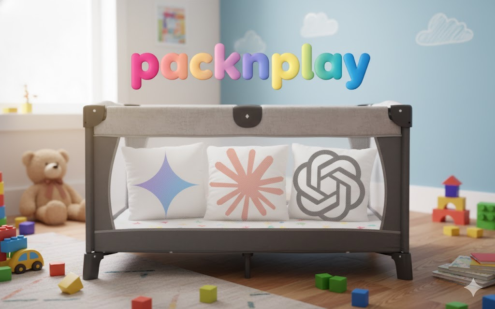

# packnplay



> **⚠️ WARNING: This code is untested and experimental. Use at your own risk. It has not been validated in production environments.**

packnplay launches commands (like Claude Code, Codex, Gemini) inside isolated Docker containers with automated worktree and dev container management.

## Features

- **Sandboxed Execution**: Run AI coding assistants in isolated Docker containers
- **Automatic Worktree Management**: Creates git worktrees in XDG-compliant locations (`~/.local/share/packnplay/worktrees`)
- **Dev Container Support**: Uses project's `.devcontainer/devcontainer.json` or feature-rich default with AI CLIs pre-installed
- **Credential Management**: Interactive first-run setup for git, GitHub CLI, GPG, and npm credentials
- **Clean Environment**: Only passes safe environment variables (terminal/locale), no host pollution
- **macOS Keychain Integration**: Automatically extracts Claude and GitHub CLI credentials from macOS Keychain

## Installation

```bash
go build -o packnplay .
sudo mv packnplay /usr/local/bin/
```

Or install directly:

```bash
go install github.com/obra/packnplay@latest
```

## Quick Start

On first run, packnplay will prompt you to configure which credentials to mount (git, GitHub CLI, GPG, npm). Your choices are saved to `~/.config/packnplay/config.json`.

```bash
# Run Claude Code in a sandboxed container (creates worktree automatically)
packnplay run claude

# Run in a specific worktree
packnplay run --worktree=feature-auth claude

# Run with all credentials enabled
packnplay run --all-creds claude

# List running containers
packnplay list

# Stop all containers
packnplay stop --all
```

## Usage

### Basic Commands

```bash
# Run command in container (auto-creates worktree from current branch)
packnplay run <command>

# Use specific worktree (creates if doesn't exist, uses if exists)
packnplay run --worktree=<name> <command>

# Skip worktree, use current directory
packnplay run --no-worktree <command>

# Pass arguments to the command
packnplay run bash -c "echo hello && ls"

# Attach to running container
packnplay attach --worktree=<name>

# Stop specific container
packnplay stop --worktree=<name>

# Stop all packnplay containers
packnplay stop --all

# List all running containers
packnplay list
```

### Credential Flags

Override default credential settings per-invocation:

```bash
# Enable specific credentials
packnplay run --git-creds claude           # Mount git config (~/.gitconfig)
packnplay run --ssh-creds claude           # Mount SSH keys (~/.ssh)
packnplay run --gh-creds claude            # Mount GitHub CLI credentials
packnplay run --gpg-creds claude           # Mount GPG keys for signing
packnplay run --npm-creds claude           # Mount npm credentials
packnplay run --all-creds claude           # Mount all available credentials
```

### Environment Variables

```bash
# Set specific environment variable
packnplay run --env DEBUG=1 claude

# Pass through variable from host
packnplay run --env EDITOR bash

# Multiple variables
packnplay run --env DEBUG=1 --env EDITOR bash
```

## How It Works

### Worktree Management

Pack 'n Play creates git worktrees in XDG-compliant locations for isolation:

- **Location**: `~/.local/share/packnplay/worktrees/<project>/<worktree>` (or `$XDG_DATA_HOME/packnplay/worktrees`)
- **Auto-create**: If you're in a git repo without `--worktree` flag, uses current branch name
- **Explicit**: `--worktree=<name>` creates new or connects to existing worktree
- **Skip**: `--no-worktree` uses current directory without git worktree
- **Auto-connect**: If container already running for a worktree, automatically connects to it
- **Git integration**: Main repo's `.git` directory mounted so git commands work correctly

### Dev Container Discovery

1. Checks for `.devcontainer/devcontainer.json` in project
2. Falls back to `ghcr.io/obra/packnplay-default:latest` if not found
3. Supports both `image` (pulls) and `dockerFile` (builds) fields
4. Auto-pulls/builds images as needed

**Default container includes:**
- Node.js v22 LTS
- AI CLI tools: Claude Code (`claude`), OpenAI Codex (`codex`), Google Gemini (`gemini`)
- GitHub CLI (`gh`)
- Git and common development utilities

## Rebuilding the Default Container

See [.devcontainer/README.md](.devcontainer/README.md) for instructions on building and publishing the default container image.

### Credential Handling

**Interactive Setup (first run):**
On first run, packnplay prompts you to choose which credentials to enable by default using a beautiful terminal UI.

**Credentials are mounted read-only for security:**
- **Git**: `~/.gitconfig` (git user configuration)
- **SSH**: `~/.ssh` (SSH keys for authentication to servers and repos)
- **GitHub CLI**: `~/.config/gh` (copied from Keychain on macOS, mounted on Linux)
- **GPG**: `~/.gnupg` (for commit signing)
- **npm**: `~/.npmrc` (for authenticated package operations)

**macOS Keychain Integration:**
- Claude credentials automatically extracted from Keychain (`Claude Code-credentials`)
- GitHub CLI credentials extracted and base64-decoded from Keychain (`gh:github.com`)
- Credentials copied into container (not mounted) to avoid file locking

### File Mounts

- `~/.claude` → mounted read-write (skills, plugins, history)
- `~/.claude.json` → copied into container (avoids file lock conflicts)
- Worktree → mounted at `/workspace`
- Main repo `.git` → mounted at its real path (git commands work)

### Environment Variables

**Safe whitelist approach:**
- Only `TERM`, `LANG`, `LC_*`, `COLORTERM` passed from host
- `HOME=/home/vscode` set in container
- `IS_SANDBOX=1` marker added
- `PATH` uses container default (not polluted from host)
- Use `--env KEY=value` or `--env KEY` to pass additional variables

### Container Lifecycle

- **Persistent containers**: Started with `packnplay run`, stay running after command exits
- **Auto-attach**: Running `packnplay run` again connects to existing container
- **Labeled**: All containers tagged with `managed-by=packnplay` for tracking
- **Clean**: Use `packnplay stop --all` to stop and remove all packnplay containers

## Requirements

- **Docker**: Docker Desktop on macOS, or Docker Engine on Linux
- **Git**: For worktree functionality
- **Go 1.23+**: For building from source
- **Optional**: GitHub CLI (`gh`) for GitHub operations

## Configuration

### Config File

`~/.config/packnplay/config.json` (XDG-compliant):

```json
{
  "container_runtime": "docker",
  "default_credentials": {
    "git": true,
    "ssh": true,
    "gh": true,
    "gpg": false,
    "npm": false
  }
}
```

Created interactively on first run. Edit manually or delete to reconfigure.

### Environment Variables

- `DOCKER_CMD`: Override docker command (e.g., `DOCKER_CMD=podman packnplay run ...`)

- `XDG_DATA_HOME`: Override data directory (default: `~/.local/share`)
- `XDG_CONFIG_HOME`: Override config directory (default: `~/.config`)

**Note:** Apple Container support was disabled due to incompatibilities. See [issue #1](https://github.com/obra/packnplay/issues/1) for details. Use Docker Desktop or Podman on macOS.

## Examples

```bash
# First run - interactive credential setup, then run Claude
packnplay run claude

# Run in specific worktree with all credentials
packnplay run --worktree=bug-fix --all-creds claude

# Run with custom environment variables
packnplay run --env DEBUG=1 --env EDITOR bash -c "echo \$EDITOR"

# Get a shell in the container
packnplay run --worktree=feature bash

# Run command in existing container (auto-connects)
packnplay run --worktree=feature npm test

# Attach with interactive shell
packnplay attach --worktree=feature

# List all running containers
packnplay list

# Stop specific container
packnplay stop --worktree=feature

# Stop all packnplay containers
packnplay stop --all
```

## Credits

- Hero image contributed by [Dan Shapiro](https://github.com/danshapiro)

## License

MIT
